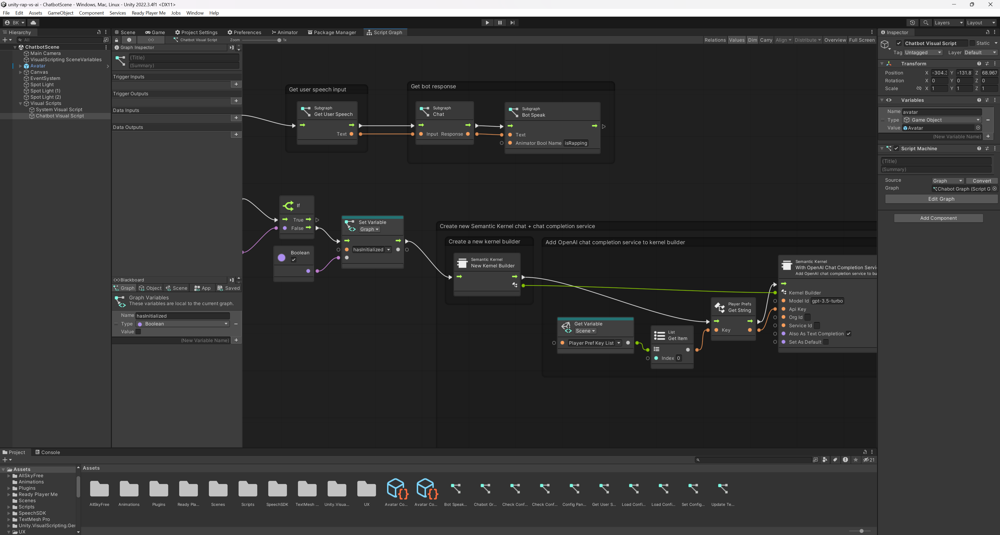

# RapVS.AI

## What is RapVS.AI?

[RapVS.AI](https://www.rapvs.ai/) blends culture, language, and AI in a modern-day remix reminiscent of the 1997 classic, IBM Deep Blue versus chess grandmaster, Garry Kasparov — a human vs. machine competition.

This project contains the code for the app built for the AI vs Humans Rap Battle at Black Tech Week, live in Cincinnati, OH in July, 2023.

## How does it work?

Using the latest GPT models from [OpenAI](https://openai.com/), the [Unity](https://unity.com/)-based app generates a rap based on the input from the user. The app uses the [Semantic Kernel](https://learn.microsoft.com/en-us/semantic-kernel) open source framework, from Microsoft, to make the requests to the OpenAI API and to display the results. There are custom visual scripting nodes for Unity included in the package, for wiring up the Semantic Kernel as an example of low/no-code programming. These provide examples for how to use the Semantic Kernel in your own apps or to add additional support for using the Semantic Kernel via visual scripting. [Azure AI Speech](https://azure.microsoft.com/en-us/products/ai-services/ai-speech) provides the text-to-speech and speech-to-text services.

### Built on the Microsoft Semantic Kernel open source framework

The Microsoft [Semantic Kernel](https://learn.microsoft.com/en-us/semantic-kernel) (SK) is a lightweight SDK enabling integration of AI Large Language Models (LLMs) with conventional programming languages. The SK extensible programming model combines natural language semantic functions, traditional code native functions, and embeddings-based memory unlocking new potential and adding value to applications with AI.

#### What is Semantic Kernel?
Semantic Kernel is an open-source SDK that lets you easily combine AI services like OpenAI, Azure OpenAI, and Hugging Face with conventional programming languages like C# and Python. By doing so, you can create AI apps that combine the best of both worlds.

#### Semantic Kernel makes AI development extensible
Semantic Kernel has been engineered to allow developers to flexibly integrate AI services into their existing apps. To do so, Semantic Kernel provides a set of connectors that make it easy to add memories and models. In this way, Semantic Kernel is able to add a simulated "brain" to your app.

Additionally, Semantic Kernel makes it easy to add skills to your applications with AI plugins that allow you to interact with the real world. These plugins are composed of prompts and native functions that can respond to triggers and perform actions. In this way, plugins are like the "body" of your AI app.

Because of the extensibility Semantic Kernel provides with connectors and plugins, you can use it to orchestrate AI plugins from both OpenAI and Microsoft on top of nearly any model. For example, you can use Semantic Kernel to orchestrate plugins built for ChatGPT, Bing, and Microsoft 365 Copilot on top of models from OpenAI, Azure, or even Hugging Face.

As a developer, you can use these pieces individually or together. For example, if you just need an abstraction over OpenAI and Azure OpenAI services, you could use the SDK to just run pre-configured prompts within your plugins, but the real power of Semantic Kernel comes from combining these components together.

See [Semantic Kernel](https://learn.microsoft.com/en-us/semantic-kernel) for more information.

### Unity Visual Scripting

[Visual scripting in Unity](https://unity.com/features/unity-visual-scripting) empowers creators to develop gameplay mechanics or interaction logic using a visual, graph-based system instead of writing lines of traditional code.

#### Create scripting logic visually
Visual scripting in Unity helps team members create scripting logic with visual, drag-and-drop graphs instead of writing code from scratch. It also enables more seamless collaboration between programmers, artists, and designers for faster prototyping and iteration.

#### Enhanced control for artists and designers
Visual scripting is a great solution for both designers and artists who want to test ideas, make changes, or maintain more direct control over their work in Unity. Non-programmers can also make use of custom nodes and graphs created by more technical team members.

#### Programmers can empower their team
Create custom nodes with visual scripting to help streamline collaboration across your team – from artists to designers. This way, more members of your team can conveniently work together while prototyping or in production, regardless of their level of programming knowledge.

## Building the App

To build the app:
-   Download and install the latest Unity editor
    -   https://unity.com/download
-   Get an API key from OpenAI
    -   Sign up for access at https://openai.com/
    -   Create a new API key at https://platform.openai.com/account/api-keys
    -   Click `+ Create new secret key` to generate a new key
-   Get an API key from Azure AI Speech
    -   Sign up for access to Azure AI Services at https://azure.microsoft.com/en-us/free/ai-services
    -   [Create a Speech resource](https://portal.azure.com/#create/Microsoft.CognitiveServicesSpeechServices) in the Azure portal
    -   Get the Speech resource key and region. After your Speech resource is deployed, select Go to resource to view and manage keys. For more information about Azure AI services resources, see [Get the keys for your resource](https://learn.microsoft.com/en-us/azure/ai-services/multi-service-resource?pivots=azportal#get-the-keys-for-your-resource).
-   Open this folder in Unity to load the project
-   Load the `Scene` > `ChatbotScene` in the Unity project
-   Click the `play` button to launch the app
-   On the configuration screen, enter the `OpenAI API Key`, `Azure Speech API Key`, and `Azure Speech Region` from above
